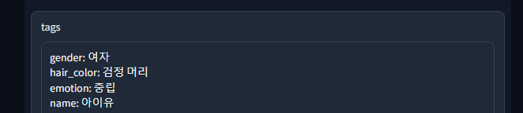

# easy-face-retrieval
FaRl, FAISS, Crawler를 이용한 쉽겍 적용할 수 있는 얼굴 검색 DB 서비스


## Envronment

```
Python 3.8+
```

## Installation

### 본인의 환경에 맞는 [PyTorch](https://pytorch.org/get-started/locally/)를 설치해주세요.

### 아래 설치는 CUDA 12.1을 기준으로 합니다 (CUDA 11.4 이상 권장)

- install conda

[https://docs.conda.io](https://docs.conda.io/projects/conda/en/stable/user-guide/install/index.html#regular-installation)

- create environment

```bash
conda create -n easyFaret python=3.8
conda activate easyFaret
```

- install pytorch

```bash
conda install pytorch torchvision pytorch-cuda=12.1 -c pytorch-nightly -c nvidia
```

- install faiss-gpu (장비에 gpu가 없다면 faiss-cpu로 바꿔 설치)

```bash
conda install -c conda-forge faiss-gpu
```


- install other packages

```bash
pip install -r requirements.txt
```

## Run Demo

- Simple Demo

```bash
python run.py -q 유재석 박명수 아이유 한지민
```

- Advanced

```bash
python run.py \
--queries ${crawling queries 없으면 비우기} \
--path ${image path} \ # 이미지 경로 쿼리 입력 시 크롤링 저장 경로
--share \ # Gradio Share
--host ${host} \ # Gradio Server name
--port ${port} \ # Gradio Server port
```

- 두번째 실행시 -q / --queries 옵션을 제외하고 실행하면 미리 받아둔 이미지를 재사용하며 실행됩니다

### Results



## References

- [Faiss](https://github.com/facebookresearch/faiss)
- [FaRL](https://github.com/FacePerceiver/FaRL)
- [facenet-pytorch](https://github.com/timesler/facenet-pytorch)
- [icrawler](https://github.com/hellock/icrawler)